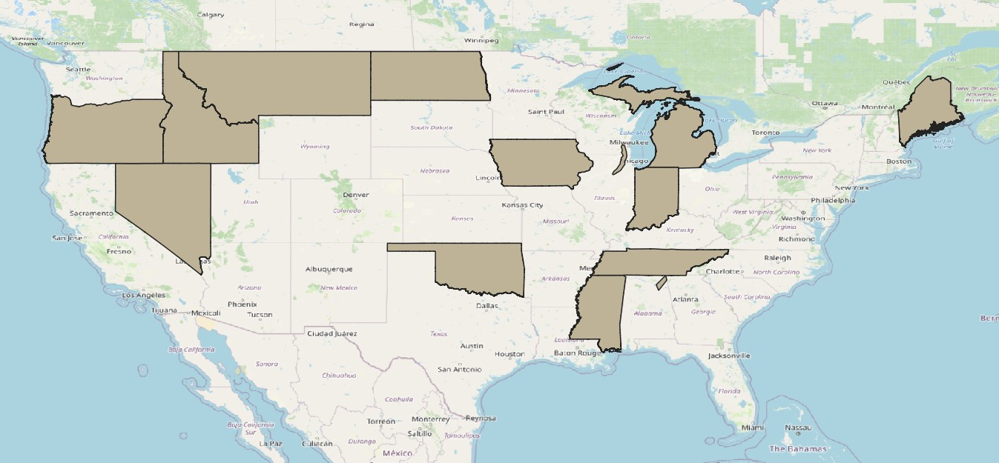

```{r setup, include=FALSE}
knitr::opts_chunk$set(echo = TRUE)
```

## The Original Data

The original data for the project was sourced from James Loewen's [Historical Database of Sundown Towns](https://justice.tougaloo.edu/sundown-towns/using-the-sundown-towns-database/state-map/). The data was in a spatial format already, with all town locations saved as points, but some of the points were in the wrong location. For this project, we wanted to find all the misplaced points, re-place them in the correct location, and generate area boundaries representing each town in addition to the points.


## Re-Geocoding the Original Data

#### Performed by [matching-original-data-to-openrouteservice-geocode.R](matching-original-data-to-openrouteservice-geocode.R)

We used the [Forward Geocode Service](https://openrouteservice.org/dev/#/api-docs/geocode) from Open Route Services to try to find correct locations for all original data points. This service can take in a town name provided by the Loewen data, and return coordinates at which this town exists. For towns with unique names like "Chicago, IL" or "Washington, D.C." this returned only one set of coordinates as the definitive location. However, for other towns there were several candidate locations.

When Open Route Services returned only one candidate location and it was within 5 kilometers of the original data point, the candidate location was saved as the "correct" point location.

When Open Route Services returned only one candidate location and it was farther than 5 kilometers from the original data, both the candidate location and the original data point were saved as potentially correct. These points would be resolved later either by a join with area locations (described below) or manually.

When Open Route Services returned multiple candidate locations, those deemed equally likely to be correct were saved. Open Route Services returns a measure of its confidence in each candidate location along with its coordinates, with 1 being the highest confidence and 0 being the least. If any point had full confidence and was within 5 kilometers of the original data, it was saved as the correct location. Otherwise, any point which either the geocoder had full confidence in or was within 5 kilometers of the original data were saved to be resolved later, again either by a join with area locations or manually. If Open Route Services returned no data points within 5 kilometers of the original data point, an additional row was saved (to be resolved later) which represented the original point location from the Loewen data set.

## Assigning Census Boundaries to Points

#### Performed by [matching-sundown-points-to-areas.R](matching-sundown-points-to-areas.R)

Area boundaries of Counties, County Subdivisions (often townships), and Places (cities and incoroporated towns) originally sourced from the 2020 US Census were downloaded from [NHGIS](https://data2.nhgis.org/main). These areas are spatially joined with the re-geocoded point representations of the sundown towns so that a version of the area is kept for each point representation of a sundown town which it contains.

There were two ways that areas and points were checked for consistency. The first was whether the name matched (if the point represented Chicago, IL and the area it fell within was named Chicago, IL that was worth 1 consistency point but if the area it fell within was named Cook County, IL that was worth zero consistency points) and the second was whether the geocoder returned a place marked at the same administrative level as the area it was joined with (if the point was supposed to be a city and the area was a place that was worth 1 consistency point, but if the area was a county that was worth zero consistency points).  

For all sundown towns in the original data set, all areas were saved which had the maximum number of consistency points for any area representing that original sundown town. So, if any areas matched the original sundown town's name and the geocoder's administrative level, no areas were saved that matched only one. If areas only existed which matched one or the other, than all areas were saved which matched one or the other. If no areas matched any, than all areas which intersected the possible point locations were saved. Whenever multiple areas were saved, if they were nested the one which was at the smallest administrative level was preferred. If they were not nested, the discrepancies were resolved manually.

## Manually Adjusting the Results

After the earlier code was run, the resulting areas was loaded into QGIS. Often, if there were no good matches for a town, it was because the name in the original data set was either misspelled or out of date (e.g. East Gary, IN has been renamed Lake Station, IN). The names of any towns in either of these categories were corrected and then they were rerun from step 1. 

Whenever there were multiple areas with the same name as a Sundown Town, the Loewen page for the original sundown town was consulted. Usually, this page contained some information which justified choosing one area or the other. Sometimes, this would be a historical event which happened there (which was referenced elsewhere online along with more spatial information), or it would be a description of a physical landmark, or it would be population data about the place which could be crossreferenced with the [Social Data Explorer](https://www.socialexplorer.com/explore-maps).

## Areas Which are not in the Census

To this point, only areas included in the Census have been added into the data, but several of the sundown towns were not included in the 2020 Census. These places are primarily ghost towns, neighborhoods, and unincorporated communities. Whenever we could find a map of these places online it was manually drawn into the data set, and when we could not a very small circle was drawn in as the town's "area." We found maps of 24 areas, but could not locate maps of another 24 sundown towns. Information on the sources of place areas outside of the census can be found [here](https://docs.google.com/document/d/16Qz6x8PpHUITAuhJ1-rgw4MBYVGsApxZ8V4Q4aNE_u0/edit?usp=sharing). 

## Areas which are not included in the Sundown Towns Map

Most areas which are not included in the Sundown Towns Map are either places which we could not find any reasonable locations for or which we could not narrow down to only one location. Some places in the original dataset (e.g. Baker, NJ) cannot be found on modern maps, and others (e.g. Dawson, IL) could be any of three different candidate places. All of these towns are listed at the bottom of [this document](https://docs.google.com/document/d/16Qz6x8PpHUITAuhJ1-rgw4MBYVGsApxZ8V4Q4aNE_u0/edit).

The other reason why a few places were not included was because they were so large that they would throw off the general look of the map. These include 14 complete US States as well as the Fox River Valley (in Wisconsin & Illinois) and Sand Mountain Alabama (a large plateau). A map of these large sundown towns is shown here:

